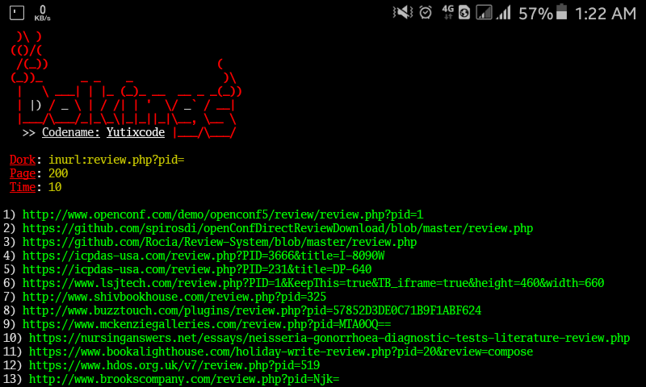

# Dolkings


## Instalations
```
$ pkg install git python
$ git clone https://github.com/Yutixcode/Dolkings
$ cd Dolkings
$ pip install -r requirements.txt
$ python dolkings.py
```

## Instructions
- **Dork**: the search query you'd like to use
- **Page**: the amount of websites to display
- **Time**: the time interval between requests

## Get in Touch
- [Facebook](https://facebook.com/njnk.xnxx)
- [Instagram](https://instagram.com/n74nk420)
